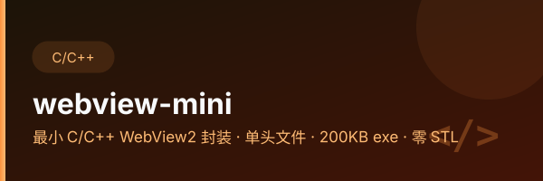

<p align="center">
  
</p>

<div align="center">
  
</div>

# webview-mini

Minimal C/C++ WebView2 wrapper for Windows - single header, xmake, STL-free.

## 与 `mc-webview-shell` 的关系

两者共用同一个 `webview.h`（单头文件 amalgamation，205 KB），区别只在定位：

- **本仓 `webview-mini`** — 通用起点：库 + xmake / CMake 构建配置 + 最小示例，STL-free。
  要自己起一个新的 WebView2 桌面壳，从这里开始。
- **[`mc-webview-shell`](https://github.com/lilyco-42/mc-webview-shell)** — 场景成品：
  针对 MC 控制台的可直接运行版本，附预编译 exe，并记录了 Clash TUN 导致 WebView2 白屏的绕法。

## Quick Start

### xmake (recommended)
```bash
xmake
```

### CMake

需要 MinGW-w64（仓库里的 `lib/libwebview.a` 是 MinGW-w64 x86_64 产物）：

```bash
cmake -B build -G Ninja -DCMAKE_BUILD_TYPE=Release
cmake --build build
```

## 作为 xmake 包引入

不想 clone 本仓时，走 [`xmake-mirror`](https://github.com/lilyco-42/xmake-mirror)：

```lua
add_repositories("lyco-mirror https://github.com/lilyco-42/xmake-mirror.git")
add_requires("webview-mini")

target("my-app")
    set_kind("binary")
    add_files("main.c")
    add_packages("webview-mini")
    add_syslinks("user32", "shell32", "ole32", "oleaut32", "shlwapi", "version", "uuid", "dwmapi")
target_end()
```

包会把 `webview.h` 和 `lib/libwebview.a` 一起装上，并自动补 `webview` / `stdc++` 链接项。
包只覆盖 MinGW；MSVC 请用 [`webview-capi`](https://github.com/lilyco-42/webview-capi)。

## Usage

```c
#include "webview.h"

int main(void) {
    webview_t w = webview_create(0, NULL);
    webview_set_title(w, "My App");
    webview_set_size(w, 800, 600, WEBVIEW_HINT_NONE);
    webview_navigate(w, "https://example.com");
    webview_run(w);
    webview_destroy(w);
    return 0;
}
```

## C 还是 C++？—— 光有头文件不够

`webview.h` 是 [webview/webview](https://github.com/webview/webview) 的 amalgamation。
`WEBVIEW_API` 怎么展开取决于语言，这一点直接决定了你要不要额外链接实现：

| 消费者 | `WEBVIEW_API` | 要做什么 |
|--------|---------------|---------|
| C++，未定义 `WEBVIEW_STATIC` | `inline` | 纯头文件，不用另编 `.cpp`。但需要 WebView2 SDK 的 `WebView2.h` |
| C，或定义了 `WEBVIEW_STATIC` | `extern` | 只有声明。**必须链接实现**：`lib/libwebview.a`，或自己编 `webview.cpp` |

所以一个 `.c` 文件只写 `#include "webview.h"` 是不够的，会报：

```
undefined reference to `webview_create'
```

## Files

| File | Description |
|------|-------------|
| `webview.h` | Single header amalgamation (205 KB) —— 声明 + C++ 实现 |
| `webview.cpp` | 静态库编译单元：`g++ -c webview.cpp -DWEBVIEW_STATIC -O2 -std=c++17` |
| `lib/libwebview.a` | 预编译静态库（MinGW-w64 x86_64）。C 消费者直接链它，**不需要 C++ 工具链，也不需要 WebView2 SDK** |
| `main.c` | Minimal example |
| `xmake.lua` | xmake config |
| `CMakeLists.txt` | CMake config |
| `packages/webview-mini/xmake.lua` | xmake 包配方（与 `xmake-mirror` 保持一致） |

> C 消费者链 `lib/libwebview.a` 时别忘了 C++ 运行库，少一个都会链接失败：
>
> ```bash
> gcc main.c -I. -mwindows -o app.exe -Llib -lwebview -lstdc++ \
>     -luser32 -lshell32 -lole32 -loleaut32 -lshlwapi -lversion
> ```
>
> 关于 205 KB：`webview.h` 在 git 里是 204977 字节（LF，6395 行）。Windows 检出
> （`core.autocrlf=true`）会给每行补一个 `\r`，变成 211372 字节 —— 旧文档里
> 那个「211 KB」是这么量出来的。

## Requirements

- Windows 10+
- WebView2 Runtime（Win10+ 自带）
- 构建：xmake，或 MinGW-w64 + CMake
- `WebView2.h`（WebView2 SDK）—— 只有 C++ 纯头文件构建需要；用 `lib/libwebview.a` 或 xmake 则不需要

## License

MIT
